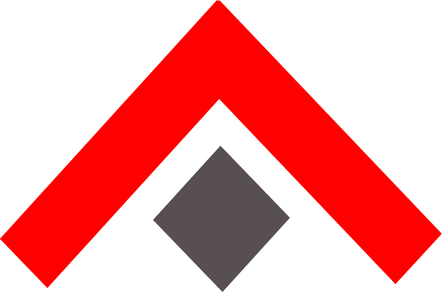

<section class="ny-landing-hero">
  

    
    
NestJS production toolkit

    <h1>Production-grade NestJS, generated from your domain model.</h1>
    

      Define resources once. NestJS-YALC generates CRUD APIs, protects service
      boundaries with API Strategy, and standardizes events, errors, and
      observability with EventManager.
    

    

      
Install the full framework

<pre class="ny-install-command"><code>npm install @nestjs-yalc/framework</code></pre>
      
...or just what you need:

      

        
        <a class="ny-package-chip" href="{{ pkg.npmUrl }}" target="_blank" rel="noopener">{{ pkg.shortName }}</a>
        
      

    

    

      <a class="ny-button" href="{{ '/getting-started' | relative_url }}">Start in minutes</a>
      <a class="ny-link-button" href="{{ '/documentation' | relative_url }}">Open the wiki</a>
    

  

  

    <input class="ny-showcase-input" type="radio" name="ny-showcase" id="ny-showcase-crud" checked>
    <input class="ny-showcase-input" type="radio" name="ny-showcase" id="ny-showcase-strategy">
    <input class="ny-showcase-input" type="radio" name="ny-showcase" id="ny-showcase-events">

    

      <label for="ny-showcase-crud" role="tab">CRUD Generation</label>
      <label for="ny-showcase-strategy" role="tab">API Strategy</label>
      <label for="ny-showcase-events" role="tab">Event Manager</label>
    

    

      <article class="ny-showcase-panel ny-showcase-panel--crud">
        

          Define a resource once. YALC turns it into REST, GraphQL, service,
          repository, and dataloader surfaces that share the same contract.
        

<pre class="ny-code-panel"><code class="language-typescript">export const usersResource = CrudGenResourceFactory&lt;SkeletonUser&gt;({
  entityModel: SkeletonUser,
  graphql: true,
  rest: true,
});</code></pre>
        

          

            Resource model
            <strong>SkeletonUser</strong>
          

          

            

              REST controller
              
GET<strong>/skeleton-user?$top=20</strong>

              
GET<strong>/skeleton-user/:id</strong>

              
POST<strong>/skeleton-user</strong>

              
PUT<strong>/skeleton-user/:id</strong>

              
DELETE<strong>/skeleton-user/:id</strong>

            

            

              GraphQL resolver
              
query<strong>getSkeletonUser</strong>

              
query<strong>getSkeletonUserGrid</strong>

              
mutation<strong>createSkeletonUser</strong>

            

          

          

            DataLoader cache
            <i></i>
            <i></i>
            <i></i>
          

        

        

          <a class="ny-button" href="{{ '/crud-gen-factory' | relative_url }}">Read CrudGen docs</a>
          <a class="ny-link-button" href="{{ '/getting-started' | relative_url }}">Run the skeleton app</a>
        

      </article>

      <article class="ny-showcase-panel ny-showcase-panel--strategy">
        

          Keep caller and emitter code stable while the selected strategy swaps
          between local calls, HTTP calls, and event emission.
        

        

          <input class="ny-strategy-input" type="radio" name="ny-strategy" id="ny-strategy-local" checked>
          <input class="ny-strategy-input" type="radio" name="ny-strategy" id="ny-strategy-http">
          <input class="ny-strategy-input" type="radio" name="ny-strategy" id="ny-strategy-event">

          

            <label for="ny-strategy-local">Local call</label>
            <label for="ny-strategy-http">HTTP call</label>
            <label for="ny-strategy-event">Event strategy</label>
          

          

            

              <pre class="ny-code-panel"><code class="language-typescript">{
  provide: USERS_API,
  useFactory: (adapter, cls, config) =>
    new NestLocalCallStrategy(adapter, cls, config),
}

@Injectable()
export class UsersApiClient {
  constructor(
    @Inject(USERS_API)
    private readonly api: IHttpCallStrategy,
  ) {}

  listUsers() {
    return this.api.get('/users');
  }
}</code></pre>
              

                

                  same client call
                  <strong>await usersApi.listUsers()</strong>
                

                

                  Caller
                  <strong>UsersApiClient</strong>
                

                

                  Strategy token
                  <strong>USERS_API</strong>
                

                

                  Same runtime
                  <strong>Nest app</strong>
                

                

                  

                    transport
                    <strong>Fastify inject('/users')</strong>
                  

                  

                    output
                    <strong>200 { list, pageData }</strong>
                  

                

              

            

            

              <pre class="ny-code-panel"><code class="language-typescript">{
  provide: USERS_API,
  useFactory: (http, cls) =>
    new NestHttpCallStrategy(http, cls, process.env.USERS_BASE_URL ?? ''),
}

@Injectable()
export class UsersApiClient {
  constructor(
    @Inject(USERS_API)
    private readonly api: IHttpCallStrategy,
  ) {}

  listUsers() {
    return this.api.get('/users');
  }
}</code></pre>
              

                

                  same client call
                  <strong>await usersApi.listUsers()</strong>
                

                

                  Caller
                  <strong>UsersApiClient</strong>
                

                

                  Strategy token
                  <strong>USERS_API</strong>
                

                

                  Remote API
                  <strong>Users service</strong>
                

                

                  

                    transport
                    <strong>Axios GET /users</strong>
                  

                  

                    output
                    <strong>200 { list, pageData }</strong>
                  

                

              

            

            

              <pre class="ny-code-panel"><code class="language-typescript">{
  provide: USER_EVENTS,
  useFactory: (eventManager: YalcEventService) =>
    new NestLocalEventStrategy(eventManager.emitter),
  inject: [YalcEventService],
}

class UsersEventsClient {
  constructor(
    @Inject(USER_EVENTS)
    private readonly events: IEventStrategy,
  ) {}

  userCreated(userId: string) {
    return this.events.emitAsync('user.created', { userId });
  }
}</code></pre>
              

                

                  same event contract
                  <strong>emitAsync('user.created', payload)</strong>
                

                

                  Emitter
                  <strong>UserService</strong>
                

                

                  Event token
                  <strong>USER_EVENTS</strong>
                

                

                  EventManager
                  <strong>YalcEventService</strong>
                

                

                  

                    local branch
                    <strong>events.emitter.emitAsync(...)</strong>
                  

                  

                    output
                    <strong>listeners + logs + optional broker</strong>
                  

                

              

            

          

        

        

          <a class="ny-button" href="{{ '/api-strategy' | relative_url }}">Read API Strategy docs</a>
        

      </article>

      <article class="ny-showcase-panel ny-showcase-panel--events">
        

          EventManager centralizes logs, domain events, and HTTP-aware errors
          behind one YalcEventService call surface. Observability can subscribe
          to the same stream and export traces, metrics, and logs.
        

        <pre class="ny-code-panel"><code class="language-typescript">@Injectable()
export class UserService {
  constructor(
    private readonly events: YalcEventService,
    private readonly users: UserRepository,
  ) {}

  async findOrFail(userId: string) {
    const user = await this.users.findById(userId);
    if (!user) {
      throw this.events.errorNotFound('user.notFound', {
        data: { userId },
      });
    }

    await this.events.logAsync(['user', 'loaded'], {
      data: { userId },
    });

    return user;
  }
}</code></pre>
        

          

            

              
              

                event source
                <strong>user.loaded</strong>
              

            

            

              structured log
              listener notified
              HTTP-aware error
            

            

              { "event": "user.loaded" }
              <strong>userId: 42</strong>
            

          

          

            

              Traces
              <i></i>
              <i></i>
              <i></i>
            

            

              Metrics
              <i></i>
              <i></i>
              <i></i>
            

            

              OTLP export
              <strong>127.0.0.1:4318</strong>
            

          

        

        

          <a class="ny-button" href="{{ '/event-manager-service' | relative_url }}">Read EventManager docs</a>
          <a class="ny-link-button" href="{{ '/observability' | relative_url }}">Read Observability docs</a>
        

      </article>
    

  

</section>

<section class="ny-section ny-section--surface">
  

    <h2>Everything NestJS gives you, plus the YALC production layer.</h2>
    

      NestJS already gives you modular architecture, dependency injection,
      TypeScript, and a strong backend ecosystem. YALC adds generated resource
      contracts, swappable service boundaries, operational primitives, and
      pre-optimized modules with AppBootstrap helpers for production-ready
      NestJS applications.
    

  

  

    <article class="ny-capability-card ny-capability-card--red">
      

        
01

        
      

      <h3>Extensible modules</h3>
      

        Keep Nest's module-first structure and generate the repetitive resource
        layer around explicit entity, DTO, service, and repository contracts.
      

      

        Modules
        DI
        Typed contracts
      

    </article>
    <article class="ny-capability-card ny-capability-card--teal">
      

        
02

        
      

      <h3>Versatile APIs</h3>
      

        Build REST, GraphQL, event-driven flows, and background-ready boundaries
        from the same resource definitions instead of hand-maintaining each surface.
      

      

        REST
        GraphQL
        Events
      

    </article>
    <article class="ny-capability-card ny-capability-card--green">
      

        
03

        
      

      <h3>Progressive boundaries</h3>
      

        Move from one runtime to distributed services by switching strategy
        providers while preserving the caller contract and testable Nest wiring.
      

      

        Local calls
        HTTP
        Microservices
      

    </article>
    <article class="ny-capability-card ny-capability-card--yellow">
      

        
04

        
      

      <h3>Everything you need to operate it</h3>
      

        Add structured events, HTTP-aware errors, traces, metrics, and logs so
        generated backends are easier to observe, debug, and evolve in production.
      

      

        Errors
        Logs
        OTLP
      

    </article>
  

</section>

<section class="ny-section ny-section--logos">
  

    <h2>Used in real production contexts.</h2>
    

      The framework patterns have been used in backend work for teams and
      products that needed stronger NestJS foundations.
    

  

  

    
    
    <a class="ny-logo-mark ny-logo-mark--azerothcore" href="https://www.azerothcore.org/" target="_blank" rel="noopener">
      
      AzerothCore
    </a>
    

      
    

  

</section>

<section class="ny-section">
  

    <h2>Explore the full documentation.</h2>
    

      Move from first setup to production architecture, generated resources,
      runtime strategies, EventManager, observability, and runnable examples.
    

  

  

    <article class="ny-card ny-card--red">
      <h3>New to the project?</h3>
      

        Start with the short setup path, then open the skeleton app and copy the
        resource factory pattern into your own module.
      

      
<a href="{{ '/getting-started' | relative_url }}">Go to getting started</a>

    </article>
    <article class="ny-card ny-card--teal">
      <h3>Need the full reference?</h3>
      

        The documentation index groups architecture guides, package references,
        example applications, test commands, and publication notes.
      

      
<a href="{{ '/documentation' | relative_url }}">Open the documentation index</a>

    </article>
  

</section>
